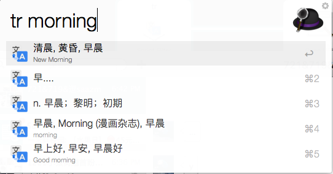
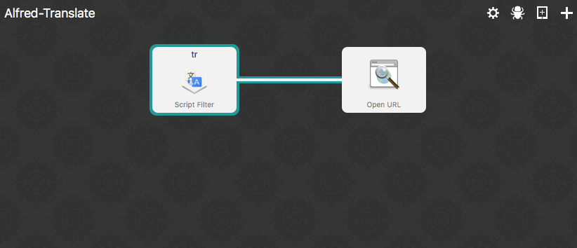

# Alfred-Tranlate
  Alfred translation workfow
  
  
  
  
# Usage
  Download and open [binary file](https://github.com/wanzysky/Alfred-Translate/blob/master/Alfred-Translate.alfredworkflow)
  
  Or git clone https://github.com/wanzysky/Alfred-Translate, and copy project into /path/to/alfred2/workflows/
  
# Issues
  Issues are welcome here, but may not be solved.
